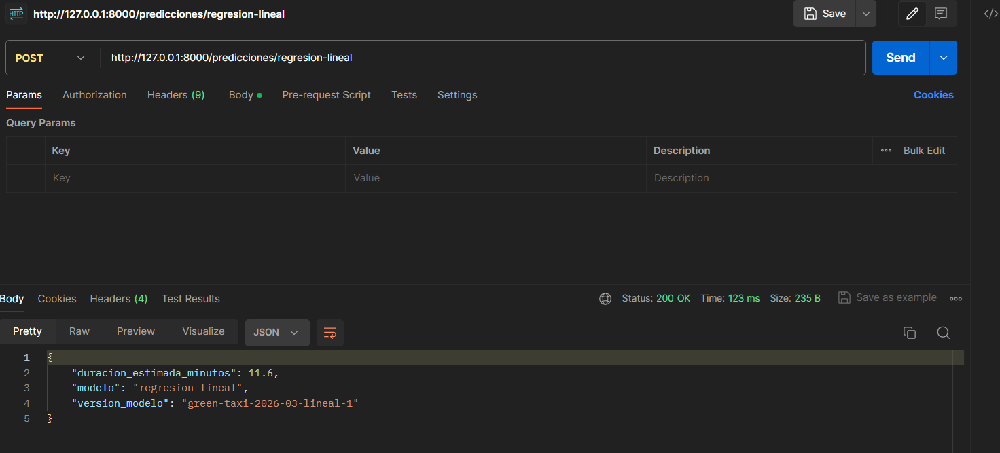
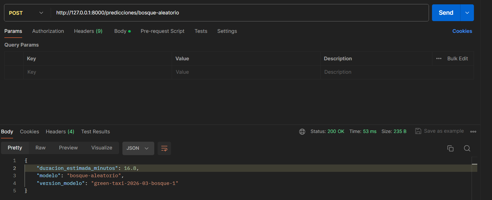
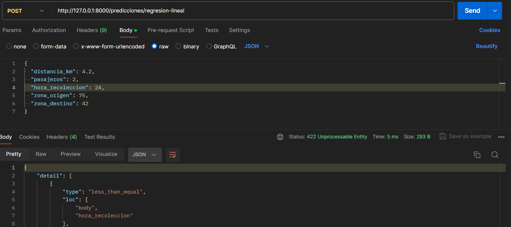
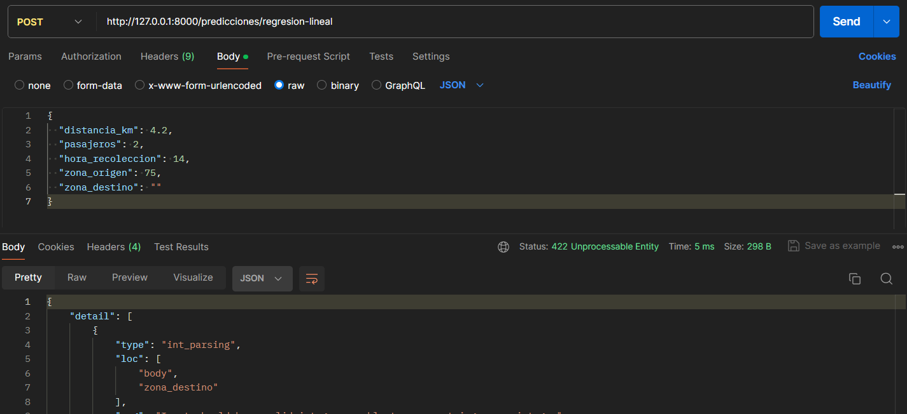

# Tarea 3 — Comparación de dos modelos servidos por una API

## Qué hace cada script

- `preparar_datos.py`: misma preparación que en la Clase 6 — calcula `duracion_minutos`, construye las cinco features (`distancia_km`, `pasajeros`, `hora_recoleccion`, `zona_origen`, `zona_destino`) y filtra viajes válidos.
- `entrenar_modelo_lineal.py`: entrena un pipeline (`OneHotEncoder` sobre zonas + `LinearRegression`) con marzo de 2026, valida con abril, mide tiempo de entrenamiento y guarda `artifacts/nyc-taxi/modelo-duracion-lineal.pkl`.
- `entrenar_modelo_bosque.py`: mismo `ColumnTransformer`, sustituye el estimador por `RandomForestRegressor(n_estimators=100, max_depth=12, min_samples_leaf=5, n_jobs=-1, random_state=42)` y guarda `artifacts/nyc-taxi/modelo-duracion-bosque.pkl`.
- `main.py`: carga ambos `.pkl` una sola vez al iniciar la app y expone `POST /predicciones/regresion-lineal` y `POST /predicciones/bosque-aleatorio`; cada endpoint solo llama a `pipeline.predict`, no reentrena.

## Ejecución

Desde la raíz del repositorio:

```bash
uv sync --locked
```

Desde esta carpeta, en orden:

```bash
uv run python entrenar_modelo_lineal.py
uv run python entrenar_modelo_bosque.py
uv run fastapi dev
```

## Comparación de resultados

| Modelo | RMSE en abril (min) | Entrenamiento (s) | Tamaño del .pkl (MiB) |
| --- | --- | --- | --- |
| Regresión lineal | 5.11 | 0.45 | 0.01 |
| Bosque aleatorio | 4.52 | 12.83 | 10.80 |

- **Menor RMSE**: el bosque aleatorio (4.52 min vs. 5.11 min). La diferencia es de 0.59 minutos (~35 segundos) por viaje en promedio — una mejora real pero modesta frente a la regresión lineal.
- **Más lento y más pesado**: el bosque aleatorio, por mucho — tardó ~28 veces más en entrenar (12.83 s vs. 0.45 s) y su artefacto pesa ~1,080 veces más (10.80 MiB vs. 0.01 MiB), porque guarda 100 árboles en vez de un solo vector de coeficientes.
- **Elección para este ejercicio**: la regresión lineal. La mejora del bosque (0.59 min) no justifica cargar un artefacto ~1,000 veces más grande ni un tiempo de entrenamiento ~28 veces mayor para un servicio que corre en un solo proceso local con datos de este tamaño; si la diferencia de RMSE fuera mucho mayor, o si el volumen de datos y el presupuesto de cómputo crecieran, la conclusión podría cambiar.
- **Servir modelos con pickles locales**:
  - Ventajas: (1) no depende de infraestructura externa ni de una base de datos — cargar el artefacto es leer un archivo; (2) la inferencia es rápida porque el pipeline ya está ajustado en memoria, sin reentrenar por solicitud.
  - Limitaciones: (1) el pickle está atado a la versión exacta de Python y de las librerías con las que se guardó, y puede fallar al cargarse en otro ambiente; (2) no hay control de versiones ni rollback automático del modelo — actualizarlo es sobrescribir un archivo a mano; (3) cargar un pickle ejecuta código arbitrario de deserialización, así que un artefacto de origen no confiable es un riesgo de seguridad.

## Evidencia

Comandos ejecutados, en este orden:

```bash
uv run python entrenar_modelo_lineal.py
uv run python entrenar_modelo_bosque.py
uv run fastapi dev
```

| Momento | Imagen | URL |
| --- | --- | --- |
| Predicción lineal (200) |  | `POST http://127.0.0.1:8000/predicciones/regresion-lineal` |
| Predicción de bosque (200) |  | `POST http://127.0.0.1:8000/predicciones/bosque-aleatorio` |
| Validación de hora inválida (422) |  | `POST http://127.0.0.1:8000/predicciones/regresion-lineal` |
| Validación de campo faltante (422) |  | `POST http://127.0.0.1:8000/predicciones/regresion-lineal` |
