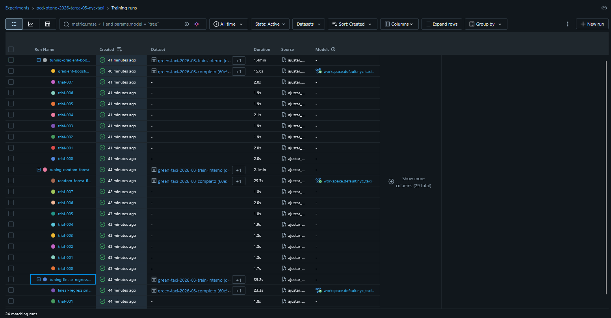
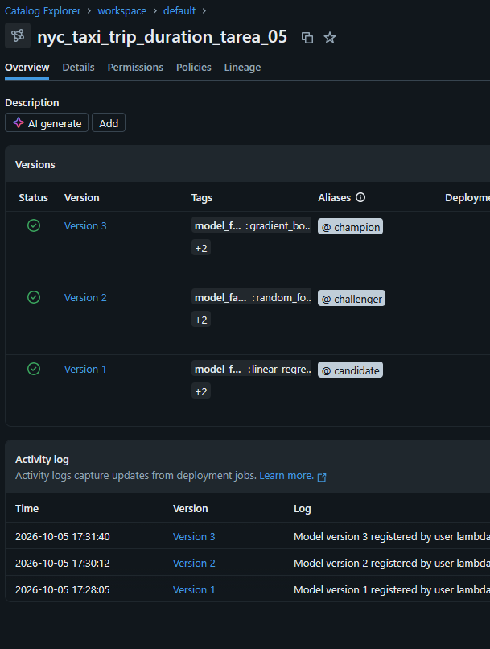
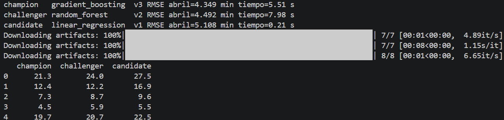

# Tarea 5 — Comparar tres familias con HPO y MLflow

## 1. Objetivo

Ajustar hiperparámetros de `LinearRegression`, `RandomForestRegressor` y `GradientBoostingRegressor` para estimar `duracion_minutos` de viajes de green taxi de NYC, registrar cada experimento en el servidor administrado de MLflow de Databricks, y asignar los aliases `champion`, `challenger` y `candidate` según el RMSE sobre abril de 2026.

## 2. Tracking URI y experimento

- Tracking: `databricks` (servidor administrado de la cuenta individual de Databricks Free Edition).
- Registry: `databricks-uc` (Unity Catalog).
- Experimento: `/Shared/pcd-otono-2026-tarea-05-nyc-taxi`.
- Modelo registrado: `workspace.default.nyc_taxi_trip_duration_tarea_05`.

El host y el token se leen de `.env`; no aparecen en el script ni en este README.

## 3. Runs anidados

```text
tuning-linear-regression
├── trial-000
├── trial-001
└── linear-regression-final

tuning-random-forest
├── trial-000 … trial-007
└── random-forest-final

tuning-gradient-boosting
├── trial-000 … trial-007
└── gradient-boosting-final
```

## 4. Separación de datos

- **Marzo de 2026 (desarrollo):** se divide con `train_test_split(test_size=0.2, random_state=42)` en entrenamiento interno y validación de tuning. Las búsquedas solo consultan estas dos particiones.
- **Reentrenamiento final:** después de elegir hiperparámetros, cada familia se reconstruye y entrena con todo marzo.
- **Abril de 2026 (validación final):** se usa una sola vez por familia, al final, para calcular el RMSE de la tabla final.

Los tres pipelines usan el mismo `ColumnTransformer` (`OneHotEncoder` sobre `zona_origen` y `zona_destino`, resto sin transformar) y las mismas cinco features: `distancia_km`, `pasajeros`, `hora_recoleccion`, `zona_origen`, `zona_destino`.

## 5. Espacios de búsqueda

| Familia | Trials | Sampler | Espacio |
|---|---:|---|---|
| Linear Regression | 2 | `GridSampler` | `fit_intercept` ∈ {True, False} |
| Random Forest | 8 | `TPESampler(seed=42, n_startup_trials=3)` | `n_estimators` ∈ {50, 100, 150}; `max_depth` ∈ {8, 12, 16}; `min_samples_leaf` ∈ {3, 5, 7} |
| Gradient Boosting | 8 | `TPESampler(seed=42, n_startup_trials=3)` | `n_estimators` ∈ {50, 100, 150, 200}; `learning_rate` ∈ [0.03, 0.2] (log); `max_depth` ∈ {2, 3, 4}; `min_samples_leaf` ∈ {3, 5, 7} |

Los rangos incluyen la configuración de la Tarea 3 (`n_estimators=100`, `max_depth=12`, `min_samples_leaf=5`) para comparar si el HPO mejora el bosque conocido. `random_state=42` y `n_jobs=-1` se conservan en el bosque.

## 6. Mejor trial por familia

| Familia | Mejor trial | Hiperparámetros | RMSE de tuning (min) |
|---|---:|---|---:|
| Linear Regression | 0 | `fit_intercept=False` | 5.048 |
| Random Forest | 2 | `n_estimators=50`, `max_depth=16`, `min_samples_leaf=5` | 4.343 |
| Gradient Boosting | 3 | `n_estimators=200`, `learning_rate≈0.166`, `max_depth=4`, `min_samples_leaf=3` | 4.235 |

## 7. Tabla final

| Familia | Mejores hiperparámetros | RMSE abril (min) | Tiempo de entrenamiento final (s) | Versión | Alias final |
|---|---|---:|---:|---:|---|
| Gradient Boosting | `n_estimators=200`, `learning_rate≈0.166`, `max_depth=4`, `min_samples_leaf=3` | 4.349 | 5.51 | v3 | `champion` |
| Random Forest | `n_estimators=50`, `max_depth=16`, `min_samples_leaf=5` | 4.492 | 7.98 | v2 | `challenger` |
| Linear Regression | `fit_intercept=False` | 5.108 | 0.21 | v1 | `candidate` |

## 8. Interpretación de la diferencia

- **Gradient Boosting vs. Random Forest:** 0.143 min de diferencia (~9 s por viaje en promedio). Es una ventaja pequeña.
- **Gradient Boosting vs. Linear Regression:** 0.759 min (~46 s). Es la diferencia más relevante del experimento.
- **Random Forest vs. Linear Regression:** 0.616 min (~37 s).

El orden de RMSE en tuning (GB < RF < LR) se conserva en abril, así que la selección no depende de una sola partición.

## 9. Ranking y justificación de aliases

1. **`champion` — Gradient Boosting (v3).** Tiene el menor RMSE en abril y también entrena más rápido que el bosque (5.51 s vs. 7.98 s). Su ventaja sobre el bosque es pequeña, pero en este caso el criterio de tiempo apunta en la misma dirección, así que no hay tensión entre desempeño y costo.
2. **`challenger` — Random Forest (v2).** Queda a 0.143 min del campeón. Entrena más lento que GB y su RMSE es mayor. Es la familia de la Tarea 3, ahora con HPO aplicado.
3. **`candidate` — Linear Regression (v1).** Es el modelo más simple y el que tarda menos (0.21 s), lo que tiene valor para explicar y depurar, pero su error es 0.76 min mayor. No gana por desempeño en este experimento.

Linear Regression no se descarta por sencillez: si la diferencia de error fuera irrelevante para el uso del modelo, podría ser el campeón. Aquí el error extra de casi 46 s por viaje sí es relevante.

## 10. Limitaciones de la búsqueda

1. **Presupuesto y fronteras de los rangos.** El mejor Random Forest tiene `n_estimators=50` (límite inferior del rango) y `max_depth=16` (límite superior), y el mejor Gradient Boosting usa `n_estimators=200` (límite superior). Eso sugiere que el óptimo podría estar fuera del espacio explorado, y que con 8 trials cada familia no se exploró a fondo.
2. **Una sola partición y una sola semilla.** El tuning usa una división aleatoria de marzo (80/20) con una semilla. Las diferencias entre Gradient Boosting y Random Forest (0.14 min) son pequeñas y podrían cambiar con otra partición o con otra semilla; no se repitió el experimento para medir esa variabilidad.

## 11. Ejecución reproducible

Desde la raíz del repositorio:

```bash
uv sync --locked
uv run python tareas/tarea-05-tuning-mlflow-databricks/ajustar_modelos.py
```

Requiere `.env` en la raíz con `DATABRICKS_HOST` y `DATABRICKS_TOKEN`, y los archivos `data/nyc-taxi/green_tripdata_2026-03.parquet` y `data/nyc-taxi/green_tripdata_2026-04.parquet` locales. Ninguno de estos archivos se versiona.

## Evidencia

| Evidencia | Imagen |
|---|---|
| Runs anidados en el experimento |  |
| Comparación y registry |  |
| Carga por alias y predicciones |  |

Predicciones de la carga por alias sobre las primeras cinco filas de abril (minutos):

| Fila | champion (GB) | challenger (RF) | candidate (LR) |
|---:|---:|---:|---:|
| 0 | 21.3 | 24.0 | 27.5 |
| 1 | 12.4 | 12.2 | 16.9 |
| 2 | 7.3 | 8.7 | 9.6 |
| 3 | 4.5 | 5.9 | 5.5 |
| 4 | 19.7 | 20.7 | 22.5 |
